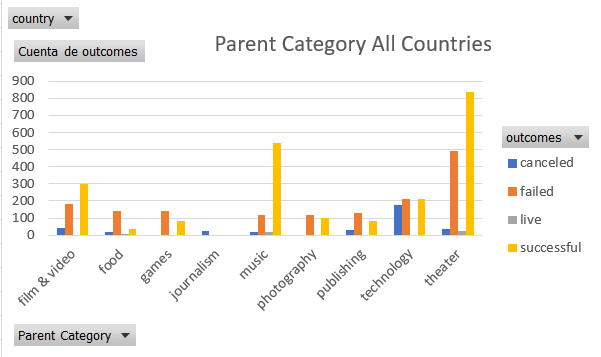
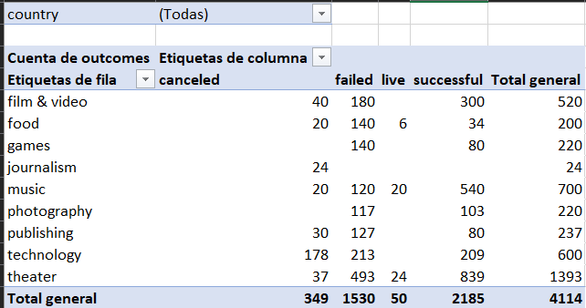
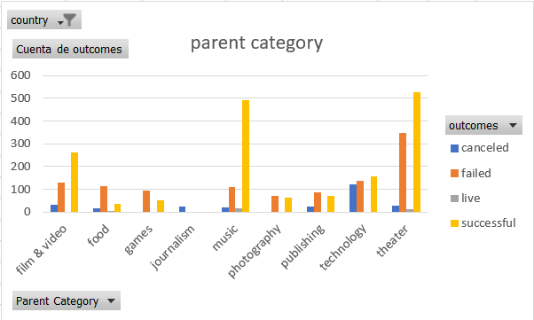
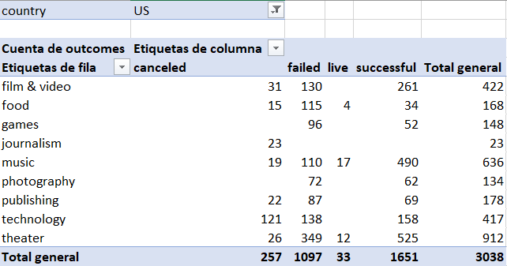
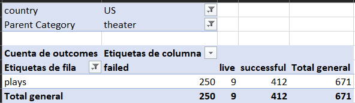
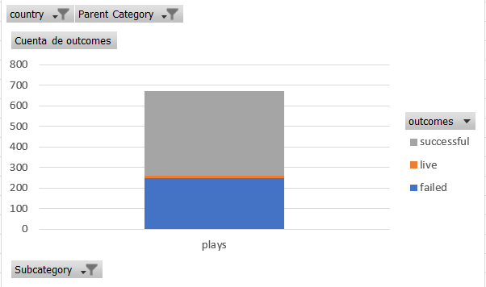
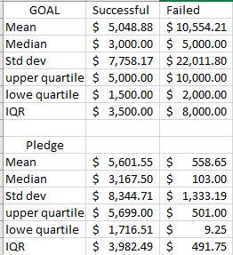
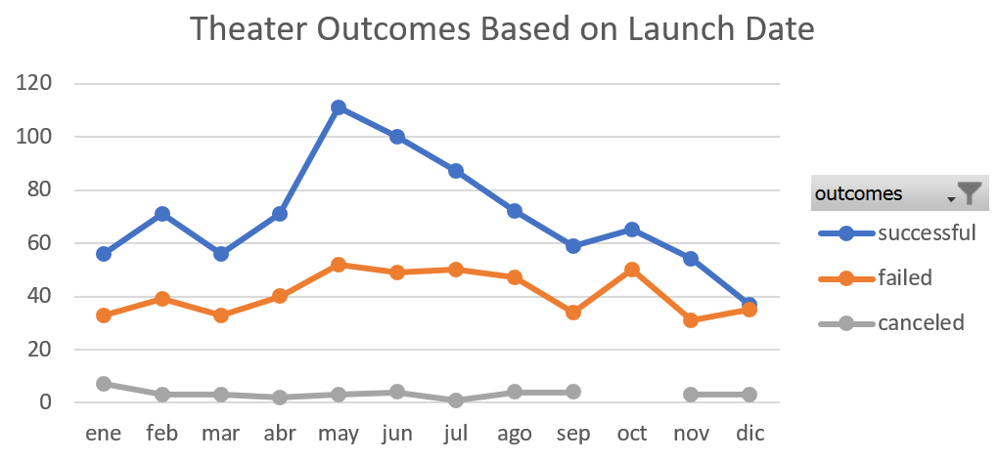
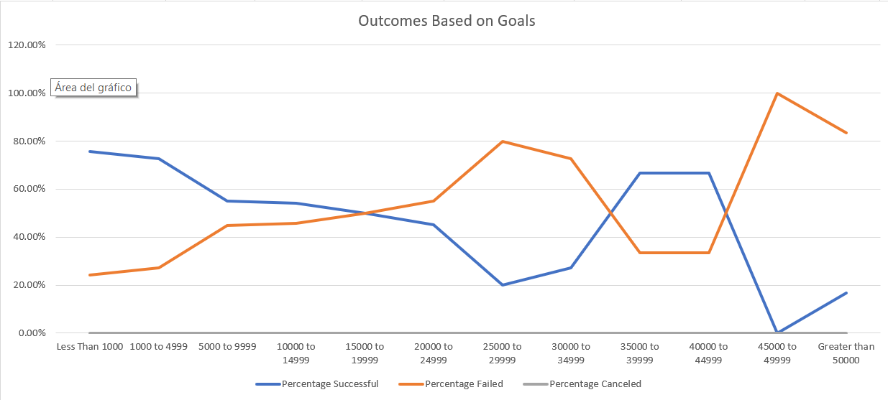

# Kickstarter Challenge 1, Louis Fundraising Analysis, deliverable 3

## abstract
 A Data analysis was undertaken on several thousand crowdfunding projects, in order to provide some useful information for desicion taking on US theatrical production fundraising campaings to costumer Louise, which has a budget estimation of 10,000$ usd to fund Fever, a play. Statistical analysis was performed to compare successful to non sucessful fundraising campaings given the kickstarter data set. Aditionally, this report analyses how different campaigns fared in relation to their launch dates and their funding goals, with quantitative and visual analysis. Furthermore, the research in subject adresses possible difficulties and limitations to the analysis as well as recomendations given the results obtained.

## General Information Analysis and Challenges

A data set of 4000 crowdfunding projects around the world is given to analyse succesful campaings. This with the purpose to help Louise what are the succesful trends these projects are taking to achieve their respective budget goal. Out of the 4,000 projects, 2185 funding projects where accomplished, that is to say, 53 % of these crowdfunding projects where completed, while 37.2%, 8% and 1% where failed, canceled and live projects, respectivly.

 Furthermore, it can be seen in the image below that the most achievable category, out of the 2185 proyects, was theater with 839 completed campaings. This represents 38% of the 2185 projects, while in second place and third place were music and films & videos, respectivly, with a total of 540 (24.7%) and 300 (13.7%) proyects completed, correspondingly. Therefore, theater holds a fairly big part portion of the successful campaings, resulting in a good option to fund. Louise has good chances of accomplishing her goal in this area. However, it is important to have in mind the cultural background, generation, ages and population criateria in order to have better success outcomes.  

## US Information Analysis And Challenges

Additionally, it can be seen from the table and image below that in the US, Theater as well is the most successful crowdfunding category, which has a positive impact on desicion making for Louis. The table shows that in US there were 1651 successful proyects and 525 of those were of theater. In other words, it represents a 31.7% portion of the successful proyects in the US, whereas the next successful category in the US holds a 29.6% share, thus theater is 2.1% more fundable than music (second most achievable in US)

In addition, as seen below, there were 671 crowdfunding proyects in the US in the subcategory plays, where 412 proyects where achieved and 250 proyects failed. That is, 61.4% and 37.2 % succeded and failed, respectively.Thus, Louise has good chances to succed at achieving the funding goal. However, local trendings must be considered in order to raise the success probability. 

### Statistical US Analysis

 As it can be see in the table below, the budget of 10,000 $ usd was estimated to fund Fever, while the average amount for successful fundrasing campaings was of 5,049 $ usd. This suggests that Louise budget is almost twice as much as the average budget succesful campaings estimates. This could affect negatively the funding success of Fever Play, is best if the budget goal decreases so it can be within the interval of the mean and standard deviation. This, with the purpose to elevate success probability for Louise. However, the mean and median pledged budgets for unsuccessful campaings are much lower than the successful pledges. This implies that failed proyects are unsuccessful for other reasins which are not related to requesting too much money. Louise should consider local trendings and cultural background as well as a local funding analysis.  

 

Additionally, acording to the statistics above it is expressed the following :

The distributions are skewed to the right, that is to say, the mean of the distributions is around the 3rd quartile. In addition, it is determined that distributions are similar.

Moreover, the upper quartile is 5000 and the lower quartile is 1500, meaning that 75% of the information is between 1500 usd and 5000 usd. Regarding the failed proyects

The standard deviation is larger than the mean.This could mean two things: 1. there must be outliers since the deviation is much larger than the mean, that is to say, , 2. every goal between the mean ± the standard deviation is accepted. That is to say, successful goals are between 5048 ± 7758 usd, whereas failed goals are between 10554 ± 22011 usd. This information clearly shows there must be some outliers due to the fact that larger standar deviation means a larger distribution of data, resulting in a not accurate statistic since it is not certain which goals are succesfull because they can vary between 12806 usd and 0 usd. This is an error of (12806/5048)*100 = 253% of an accurate value of a mean. Since the analysis it is focused in US trendings, outliers can be erradicated if the statistics are only for the thater-play proyects. 

### US Analysis of Outcomes Based on Launch Date

It is important to consider optimal dates to increase success probability. As it is shown in the image below, the best dates to start the funding proyects are from april unitl september, with peak at may. The reason of these dates are that failed campaings remain constant while successful campaigs start raising from april to may, and even though successful proyects start to decrease from may to september the numbers of successful proyects are still over the remaining successful campaings in the other dates. That is to say, these numbers are higher than in other dates. Besides, failed campaings outcomes are still less than successful outcomes. Furthermore, since failed campaings remain constant it is possible to predict better outcomes and forecast results. That is to say, there is a margin of error in those months that allows funding a proyect with success, each month with less probability than the last, but still with a positive outcome since failed proyects remain constant and successful proyects are over them. additionally, it is not recommended to start a funding proyect in dicember since successful and failed outcomes intersect, meaning that chances of failure and success are equal (50%), thus not having certainty in the outcome. 

### US Analysis of Outcomes Based on Goals

Many crowdfunding proyects in the US failed due to the fact that their goals were either too high, depending on the proyect, or not high enough to fund and complete the proyect. In the graph below it can be seen that most proyects that had a goal in between 0 and 15000 (exclulding endpoints 0 and 15000) were achieved with a porcentage of success of 79% and decreasing TO as the goal increased. It can be seen that porcentage of success dropped from 76% to 58& when the goal changed from 1000 to 5000 , which it is still a good probability. Nonetheless, as the goal increased from 5000 to 15000, porcentage of success decreased from 58% to 50%, this is where porcentage of success intersects with porcentage of failure, which is in the end point of 15000. Resulting in a possible negative outcome if the funding campaing has those goals. Moreover, it can be shown that porcentage of failure starts to increase significantly from 50% to 80% as the goal increments from 15000 to 30000.This could suggest that the goal is very high or not high enough to sustend the proyect. In addition, porcentage of success increases from 50% to 72% as the goal rises from 35000 to 40000, while the failure success dropps to 30%, suggesting a good probability for completing the goal. AS the goal increoases to more than 50000, success porcentage dropps dramatically and failure porcentage increase up to 100%, therefore, it is not suggested to have a goal of that magnitude.

## Results

- What are two conclusions you can draw about the Outcomes based on Launch Date?

it is recommended to start the funding proyect in between april and september
it is not recommended to start de proyect in september since there is a lot of risk of failure.

- What can you conclude about the Outcomes based on Goals?

it is not suggested to have a goal greater than 50000 since failure procentage is 100% as well as to not have a goal between 15000 to 30000.Louise, should probIably have an estimated goal in the interval of 0-10000 usd. 

- What are some limitations of this dataset?
this data set only includes a handful of countries and parent categories, so if a better analysis wants to be undertaken, it should include more categories, for instance concerts as well as more countries. In addition, outliers must be analysed in order to have an accurate statistic and show better results with the purpose of a better recommendation. It can be helpful to establish a mark of reference to analyse proper data, this could be only theater, music, festivals and entretainment categories. 

- What are some other possible tables and/or graphs that we could create?
 pie graphs to show visualy which category has more success and a brake even analysis graph to determine funding success as well as a margin of error analysis to accomplish the Fever play. 
